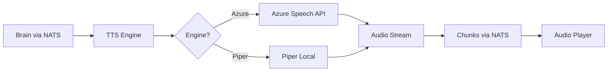
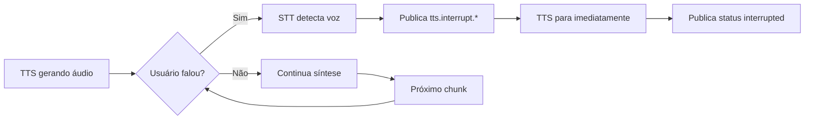

# 🔊 TTS Engine

**Container:** `tts-engine`  
**Ecossistema:** Mordomo  
**Protocolo:** NATS (Infraestrutura) + FastAPI (HTTP/REST)

---

## 📋 Propósito

Sintetizar respostas do Brain em áudio natural PT-BR, com suporte a streaming e baixa latência.

---

## 🎯 Responsabilidades

- ✅ Receber texto do Core API/Brain via NATS
- ✅ Sintetizar áudio em streaming (chunks)
- ✅ **Interrompível**: Para síntese quando usuário fala
- ✅ Baixa latência (<500ms)
- ✅ Voz natural em português brasileiro
- ✅ Fallback offline quando Azure indisponível
- ✅ Suporte a múltiplos speakers simultâneos

---

## 🔧 Engines TTS

**Linguagem:** Python (FastAPI)

**Por que Python?** Latência dominada por Azure API (200ms) ou Piper model (100ms). Overhead Python (<5ms) desprezível no contexto total.

### Primário: **Piper TTS (Local)**
- **Modelo Padrão**: `pt_BR-faber-medium.onnx`
- **Latência**: ~100ms (no Orange Pi 5)
- **Vantagem**: Resposta instantânea, privacidade total, zero custo.
- **Specs**: 22050 Hz, Mono.

### Secundário: **Azure Cognitive Services (Cloud)**
- **Uso**: Textos longos (> 200 caracteres) ou fallback.
- **Voz**: pt-BR-DonatoNeural
- **Latência**: ~300ms + Network
- **Custo**: Free Tier (500k chars/mês)

---

## 📊 Especificações

```yaml
Piper Audio (Padrão):
  Sample Rate: 22050 Hz
  Channels: 1 (mono)
  Format: PCM 16-bit
  Bitrate: 44.1 kbps

Azure Audio (Long-form):
  Sample Rate: 16000 Hz
  Channels: 1 (mono)
  Format: PCM 16-bit
  Codec: RIFF WAV

Performance:
  Latência Piper: ~100ms (Instantâneo)
  Latência Azure: ~300ms
```

---

## 📥 Instalação dos Modelos

Para usar o Piper, você precisa baixar o modelo `faber` e seu config JSON para a pasta de modelos:

```bash
mkdir -p models
cd models
# Baixar Modelo
wget https://huggingface.co/rhasspy/piper-voices/resolve/v1.0.0/pt/pt_BR/faber/medium/pt_BR-faber-medium.onnx
# Baixar Config
wget https://huggingface.co/rhasspy/piper-voices/resolve/v1.0.0/pt/pt_BR/faber/medium/pt_BR-faber-medium.onnx.json
```

---

## 🔌 Interfaces

### Input (NATS)

**1. Requisições de Síntese**
```python
subject: "tts.generate.{speaker_id}"
payload: {
  "text": "A temperatura atual é 23 graus",
  "speaker_id": "user_1",
  "engine": "azure",  # azure | piper (opcional)
  "voice": "donato",  # nome da voz (opcional)
  "gender": "masculino"  # masculino | feminino (opcional)
}
```

**2. Comandos de Interrupção**
```python
subject: "tts.interrupt.{speaker_id}"
payload: {}  # Vazio, apenas trigger

# Enviado por: STT quando detecta voz do usuário
# Efeito: Para síntese imediatamente, descarta buffer
```

### Output (NATS)

**1. Chunks de Áudio**
```python
subject: "tts.audio_chunk.{speaker_id}"
payload: {
  "data": "<base64 PCM>",  # Áudio codificado em base64
  "chunk_index": 0,
  "is_final": false,  # true no último chunk
  "timestamp": 1732723200.123,
  "engine": "azure"
}
```

**2. Status da Síntese**
```python
subject: "tts.status.{speaker_id}"
payload: {
  "status": "started",  # started | completed | interrupted | error
  "speaker_id": "user_1",
  "engine": "azure",
  "timestamp": 1732723200.123,
  
  # Campos adicionais conforme status:
  "chunks_sent": 42,  # quando completed
  "error": "...",  # quando error
}

# Status possíveis:
# - started: Síntese iniciada
# - completed: Síntese finalizada com sucesso
# - interrupted: Usuário interrompeu (começou a falar)
# - error: Erro na síntese
```

### HTTP API (Testes/Desenvolvimento)
```http
POST /synthesize
{
  "text": "Olá, mundo!",
  "engine": "azure",  # opcional
  "streaming": true
}

GET /health
# Retorna engines disponíveis e status

POST /test-latency
# Testa latência de uma engine específica
```

---

## ⚙️ Configuração (.env)

```bash
# Server
HOST=0.0.0.0
PORT=8007

# Azure TTS (Primário)
AZURE_SPEECH_KEY1=your_key_here
AZURE_SPEECH_KEY2=your_backup_key
AZURE_SPEECH_REGION=brazilsouth

# Default Engine
TTS_ENGINE=azure  # azure | piper

# NATS (Infraestrutura)
NATS_URL=nats://localhost:4222

# Audio Settings
SAMPLE_RATE=22050
CHANNELS=1
BIT_DEPTH=16
CHUNK_SIZE=4096
```

---

## 🔄 Fluxo de Processamento

### Síntese Normal (Sem Interrupção)


### Síntese com Interrupção


### Processamento Detalhado
```python
async def synthesize_text(text: str, speaker_id: str):
    # 1. Receber requisição via NATS (tts.generate.{speaker_id})
    
    # 2. Selecionar engine (Azure primário, Piper fallback)
    engine = tts_engines.get("azure") or tts_engines.get("piper")
    
    # 3. Marcar início de síntese
    await interruption_manager.start_synthesis(speaker_id)
    
    # 4. Publicar status "started"
    await nats.publish(f"tts.status.{speaker_id}", {"status": "started"})
    
    # 5. Sintetizar em streaming com verificação de interrupção
    chunk_index = 0
    async for chunk in engine.synthesize_stream(text):
        # Verificar se usuário interrompeu
        if await interruption_manager.is_interrupted(speaker_id):
            logger.info("Synthesis interrupted by user")
            break
        
        # Publicar chunk no NATS
        await nats.publish(
            f"tts.audio_chunk.{speaker_id}",
            {
                "data": base64.b64encode(chunk).decode(),
                "chunk_index": chunk_index,
                "is_final": False
            }
        )
        chunk_index += 1
    
    # 6. Verificar se completou ou foi interrompido
    if not interrupted:
        # Marcar chunk final
        await nats.publish(
            f"tts.audio_chunk.{speaker_id}",
            {"chunk_index": chunk_index, "is_final": True}
        )
        
        # Publicar status "completed"
        await nats.publish(
            f"tts.status.{speaker_id}",
            {"status": "completed", "chunks_sent": chunk_index}
        )
    
    # 7. Limpar recursos
    await interruption_manager.end_synthesis(speaker_id)
```

### Exemplo de Interrupção
```python
# Timeline de uma conversa:

# t=0ms: Brain envia texto para TTS
→ tts.generate.user_1 {"text": "A temperatura está..."}

# t=50ms: TTS inicia síntese
→ tts.status.user_1 {"status": "started"}

# t=150ms: Primeiro chunk de áudio
→ tts.audio_chunk.user_1 {"data": "...", "chunk_index": 0}

# t=300ms: Usuário começa a falar
→ STT detecta voz do usuário

# t=310ms: STT envia comando de interrupção
→ tts.interrupt.user_1 {}

# t=315ms: TTS para síntese
→ tts.status.user_1 {"status": "interrupted"}

# Resultado: Mordomo para de falar imediatamente
```

---

## 🎨 Vozes Azure Disponíveis

Lista de vozes mais rápidas documentada nesta seção.

**Top 5 Mais Rápidas:**
1. Francisca (F) - 212ms
2. Yara (F) - 253ms
3. **Donato (M) - 291ms** ⭐ PADRÃO
4. Valerio (M) - 297ms
5. Humberto (M) - 305ms

---

## 📦 Dependências

```txt
# Core
fastapi==0.104.1
uvicorn[standard]==0.24.0
python-dotenv==1.0.0
pydantic==2.5.0

# TTS Engines
azure-cognitiveservices-speech==1.47.0  # Primário
piper-tts==1.2.0  # Fallback offline

# Event Bus
nats-py==2.6.0

# Testing
pytest==7.4.3
httpx==0.25.2
```

---

## 🐳 Docker

```dockerfile
FROM python:3.11-slim

WORKDIR /app

# Install dependencies
COPY requirements.txt .
RUN pip install --no-cache-dir -r requirements.txt

# Download Piper voice model (fallback)
RUN python -c "from piper import PiperVoice; \
    PiperVoice.load('pt_BR-faber-medium')"

# Copy application
COPY . .

EXPOSE 8007

CMD ["python", "main.py"]
```

---

## 📈 Métricas

```python
# Sínteses
tts_synthesis_total{engine, speaker_id}
tts_characters_synthesized_total{engine}

# Performance
tts_latency_ms{engine}  # Latência total
tts_first_chunk_ms{engine}  # Tempo até primeiro chunk

# Engines
tts_engine_health{engine}  # 0=down, 1=up
tts_fallback_activations_total  # Quantas vezes caiu para Piper
```

---

## 🚀 Uso

```bash
# Instalar dependências
pip install -r requirements.txt

# Configurar .env
cp .env.example .env
# Editar AZURE_SPEECH_KEY1, AZURE_SPEECH_REGION

# Iniciar servidor
python main.py

# Testar API
curl -X POST http://localhost:8007/synthesize \
  -H "Content-Type: application/json" \
  -d '{"text": "Olá, mundo!", "engine": "azure"}'
```

---

## 🔍 Troubleshooting

**Azure não funciona:**
- Verificar keys no .env
- Confirmar region=brazilsouth
- Testar: `curl https://{region}.api.cognitive.microsoft.com/sts/v1.0/issuetoken`

**Piper não encontra modelo:**
- Executar: `python -c "from piper import PiperVoice; PiperVoice.load('pt_BR-faber-medium')"`
- Modelo será baixado em `~/.local/share/piper-voices/`

**Latência alta:**
- Azure: Trocar voz (Francisca 212ms, Donato 291ms)
- Piper: Sempre ~108ms
- Network: Verificar latência para Azure Brasil South

---

*Última atualização: Dezembro 2025 - Testes completos Azure + Piper*
